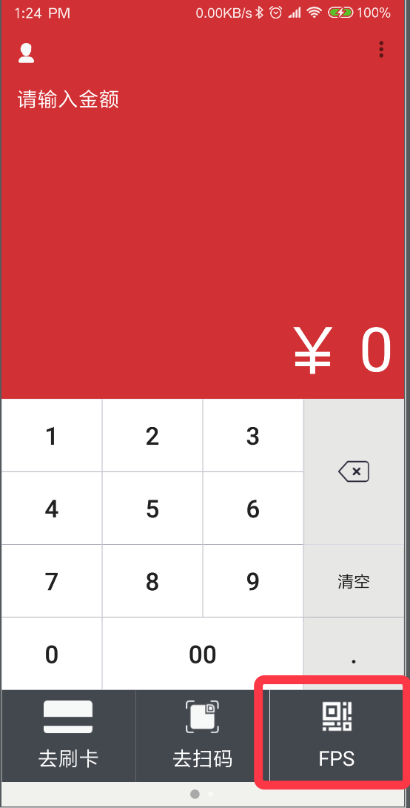

## Preview


## Code

Some code should add to your projects.

### APP A(PAX A920 Cashier):

* Add a button named FPS in your appliaction



* Implement the OnClickListener :

```java
    Uri data = Uri.parse("cil://www.everonet.com/payment");
    intent = new Intent(Intent.ACTION_VIEW, data);
    intent.setFlags(Intent.FLAG_ACTIVITY_NEW_TASK);
    try {
        startActivityForResult(intent, 666);
    } catch (Exception e) {
        e.printStackTrace();
        Toast.makeText(getActivity(), "the EvoCashier is not installed", Toast.LENGTH_SHORT).show();
    }
```

### APP B(EvoCashier):

`APP B` needs `APP A`'s `package name` and `application id` for back to `APP A`, such as:

* packageName: "com.cardinfolink.smart.pos"
* applicationId: "com.cardinfolink.smart.pos"
